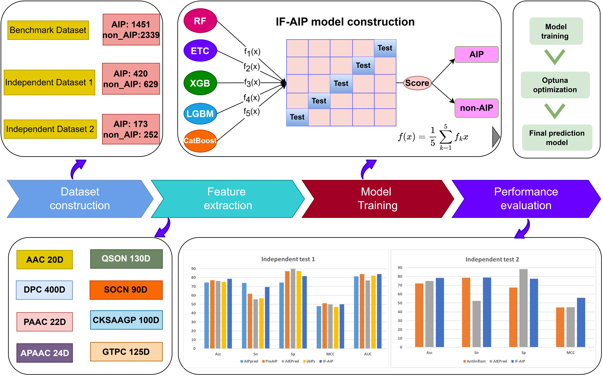

# IF-AIP
This is the corresponding repository of the paper titled "IF-AIP: a machine learning method for the identification of anti-inflammatory peptides using multi-feature fusion strategy".

# Installation
------------------------------------------------------------------------
1. scikit-learn  === 1.2.2
2. xgboost === 1.7.5
3. catboost === 1.1.1
4. lightgbm === 3.3.5
